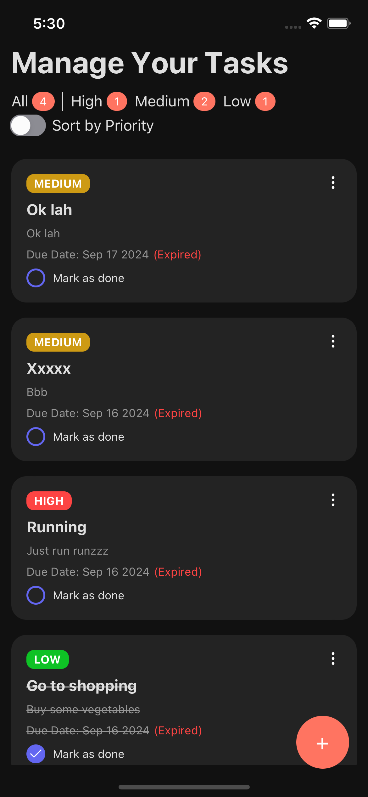
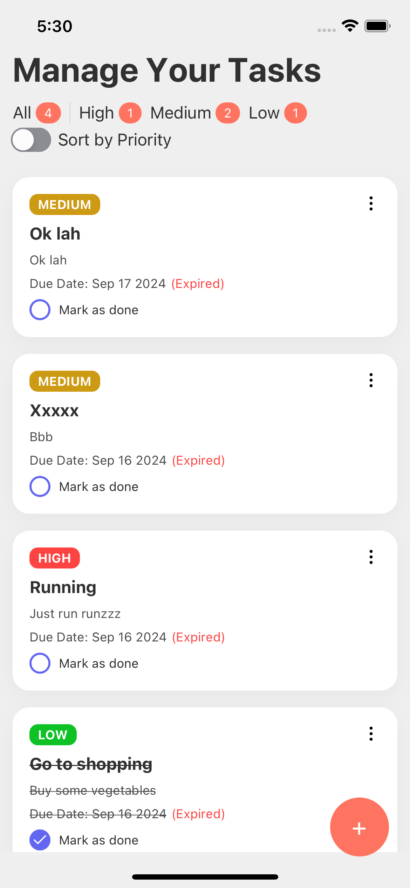

## Prerequisites

- [Node.js > 16](https://nodejs.org) and npm (Recommended: Use [nvm](https://github.com/nvm-sh/nvm))
- [Watchman](https://facebook.github.io/watchman)
- [Xcode 12](https://developer.apple.com/xcode)
- [Cocoapods 1.10.1](https://cocoapods.org)
- [JDK > 11](https://www.oracle.com/java/technologies/javase-jdk11-downloads.html)
- [Android Studio and Android SDK](https://developer.android.com/studio) (make sure your ndk > 27 or you need to upgrade it for android build)

## DEMO
| Dark Mode | Light Mode |
|-----------|------------|
|  |  |

## Getting Started

This is a [React Native](https://reactnative.dev) application using typescript

## Installation

```bash
npm install
# or
yarn install
```

## Build and Run

### IOS

```bash
cd ios
pod install
yarn run ios
```

### Android

```bash
yarn run android
```

Open your simulator to see the result.

## Project Structure

| Folders            | Description                                                                                                                                                             |
| ------------------ | ----------------------------------------------------------------------------------------------------------------------------------------------------------------------- |
| `src/components`   | Home to application components, following the [atomic design](https://bradfrost.com/blog/post/atomic-web-design/) methodology for organizing presentational components. |
| `src/hooks`        | Custom hooks used throughout the application.                                                                                                                           |
| `src/navigators`   | Navigator components responsible for handling navigation.                                                                                                               |
| `src/screens`      | Screen components representing various app screens.                                                                                                                     |
| `src/services` ️   | Houses data fetching and related services.                                                                                                                              |
| `src/store` ️      | State management by redux                                                                                                                                               |
| `src/theme`        | Holds theme configuration for the application.                                                                                                                          |
| `src/translations` | Configuration related to language support.                                                                                                                              |
| `src/types`        | Custom type definitions for the project.                                                                                                                                |
